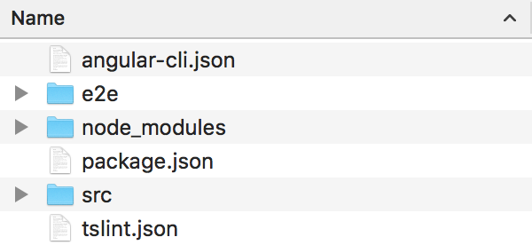
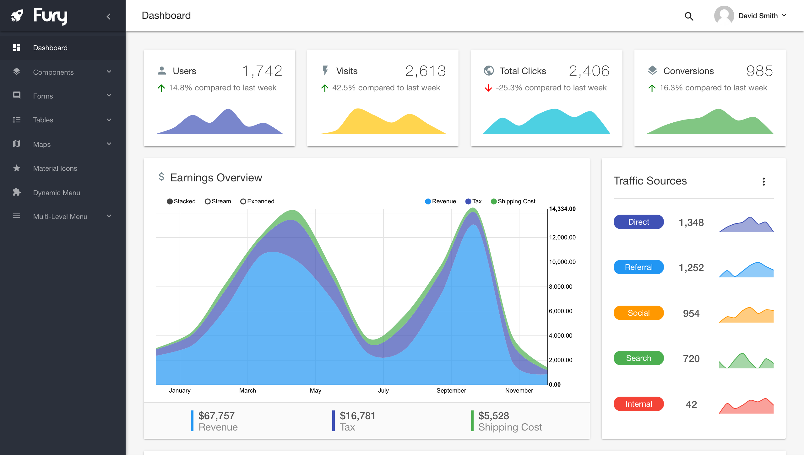

# Fury - Angular 2 Material Design Admin Template
## Introduction

Fury is a creative material design admin template built with Angular 2 and the Angular-CLI. It extends the Material Design components built by the Angular 2 team and it offers you everything you need to get started with your next CRM, CMS or dashboard based project.

Support is available through email, ThemeForest comments or chat. If you purchased the theme and love it, consider giving it a 5-star rating here on ThemeForest. It really helps pushing out more updates and adding more great features.

## Table of Contents

   * [Fury - Angular 2 Material Design Admin Template](#fury---angular-2-material-design-admin-template)
      * [Introduction](#introduction)
      * [Getting Started](#getting-started)
         * [Folder Structure](#folder-structure)
         * [Using Angular-CLI](#using-angular-cli)
         * [Prerequisites](#prerequisites)
         * [Installing Angular-CLI](#installing-angular-cli)
         * [Generating the first Component](#generating-the-first-component)
         * [Generating a Service in a specific folder](#generating-a-service-in-a-specific-folder)
         * [Live-Preview and App-Start](#live-preview-and-app-start)
      * [Customizing](#customizing)
         * [Add a Menu Item](#add-a-menu-item)
         * [Breadcrumbs](#breadcrumbs)
         * [Receive, send and map data to a server with GET and POST requests](#receive-send-and-map-data-to-a-server-with-get-and-post-requests)
         * [URL mapping on an Apache Server](#url-mapping-on-an-apache-server)
      * [Credits](#credits)
         * [Assets](#assets)

## Getting Started

In this section you will find the basic folder structure and everything you need to get the theme up and running the first time to start developing.

### Folder Structure

| Name                  | Description |
| -------------:        |---------------
| `angular-cli.json`    | Used for configuration of project specific settings. You can add external styles and scripts, change the output folder, add assets, add environment files and more. | 
| `e2e`                 | Will be used for end-to-end tests to ensure functionality for users before deploying.      |
| `node_modules`        | All external modules used are here. Do not mess with this folder, as it is auto-generated by using `npm install`.      |
| `package.json`        | Contains all dependencies used for production and development. |
| `src`                 | Contains all Angular 2 Typescript code, assets and basically everything the end user will have access to. |
| `tslint.json`         | Angular-CLI includes an automatic Typescript-Linter, which can be configured with this file. |



---

### Using Angular-CLI

Angular-CLI allows you to create a new App in a matter of seconds and provides an awesome way to generate scaffolds for basically all Angular2-Components. [You can take a look at what commands are available here.](//github.com/angular/angular-cli#generating-components-directives-pipes-and-services)

In this article, we are going to install Angular-CLI and it's prerequisites and then generate our first project with a few various components.

---

###Prerequisites
Before we can install Angular-CLI we will have to get a few thing set up first. To run Angular-CLI we will need to install these 2 prerequisites first.

* **NodeJS** v4 or newer  
and
* **Typings** v1 or newer

[A detailed instruction on how to install NodeJS is available here.](//docs.npmjs.com/getting-started/installing-node)

After installing NodeJS there is just one thing left to do: Simply install **Typings** globally by running the command `npm install -g typings` and wait for *npm* to do the dirty work.

If you are on a *UNIX environment, you might have to run the command as administrator. This is done by simply prepending sudo: `sudo npm install -g typings`

---

###Installing Angular-CLI
Installing Angular-CLI is as simple as running this simple command:

`npm install -g @angular/cli@latest`  
or
`sudo npm install -g @angular/cli@latest`

and the package manager `npm` will do the rest.

---

###Generating the first `Component`
Now that we have installed all prerequisites it's time to start developing our app. Angular-CLI offers a lot of assistance and allows you to generate basically all Angular2-Components there are. *(In a smart way!)*

To generate our first `component` we simply open up a terminal and navigate in our Angular2-App. Now we simply run `ng g component client` and we get a new component in `/src/app/client` with the following files:

* `client.component.ts`
* `client.component.html`
* `client.component.css`
* `client.component.spec.ts`

The files `client.component.ts` and `client.component.spec.ts` contain the most code, the other files only contain placeholders.

**client.component.ts**

```typescript
import { Component, OnInit } from '@angular/core';

@Component({
  moduleId: module.id,
  selector: 'app-client',
  templateUrl: 'client.component.html',
  styleUrls: ['client.component.css']
})
export class ClientComponent implements OnInit {

  constructor() { }

  ngOnInit() {
  }

}
```
By executing this short command, we just saved ourselves a lot of time creating all these `Component` files and boilerplate code.

[Syntax for all commands are available here.](//github.com/angular/angular-cli#generating-components-directives-pipes-and-services)

---

###Generating a Service in a specific folder
Now we have our `component`, but what if we want to share some data between components and need to create a `service` to manage this all. Well, we probably would want the service to be in the correct folder, either right in the components folder or in the `shared` folder in `/src/app/`.

Either way, with Angular-CLI we can generate in any folder, wherever we want. Simply use the path *(relative to `/src/app/`)* and use it as the name of the generated component.

`ng g service shared/client`  
or
`ng g service client/shared/client`

Or anything you need.
Afterward we will find two generated files in our specified folder: `client.service.ts` and `client.service.spec.ts`.

**client.service.ts**
```typescript
import { Injectable } from '@angular/core';

@Injectable()
export class ClientService {

  constructor() { }

}
```
###Live-Preview and App-Start

Now that we have generated our components, we sure want to see how the result will look like. Luckily Angular-CLI comes pre-configured with a **Live Compile and Reload Server** for which you simply have to run `ng serve` and after a few seconds your site will be live at `http://localhost:4200`.



All changes you now make to your app will automatically be compiled and your open browser window will be reloaded.

These were the first steps with the awesome Angular-CLI and Angular2. Following we are going to get more in detail about developing with Angular-CLI and using the power of Angular2 right.

## Customizing

Everything shown in the demo can also be customized and most things are generated dynamically, for example the navigation menu.

### Add a Menu Item

Menu Items can be added in runtime by importing the `SidenavService` and adding menu items there. Here's an example:
```typescript
export class TestComponent {
  constructor(
    private sidenavService: SidenavService
  ) {
    let components = sidenavService.addItem('Components', 'layers', '/components', 2);
                     sidenavService.addSubItem(components, 'Buttons', '/components/buttons', 1);
   }
}
```

The function `addItem` accepts 4 parameters:
```typescript
sidenavService.addItem('The name shown in the navigation menu',
                       'the material icon to be used', 
                       'the route to put in [routerLink]',
                       'position in menu as number');
```

To create a dropdown menu with sub-items you can use the `addSubItem` function. The parameters are similar:
```typescript
sidenavService.addSubItem(referenceToParentItem (as shown in the example above),
                       'The name shown in the navigation menu',
                       'the material icon to be used', 
                       'the route to put in [routerLink]',
                       'position in sub-menu as number');
```

### Breadcrumbs

Breadcrumbs are generated automatically from the current route, but you can also add custom user-friendly names. Adding "friendly names" for routes is done like this:
```typescript
export class TestComponent {
  constructor(
    private breadcrumbService: BreadcrumbService
  ) {
    breadcrumbService.addFriendlyNameForRoute('/components', "Components");
    breadcrumbService.addFriendlyNameForRoute('/components/buttons', "Buttons");
   }
}
```

The first parameter is the route to name, the second is the new breadcrumb name for this route.

### Receive, send and map data to a server with GET and POST requests

Receiving data from a server to process or display it in Angular 2 can be quite tricky with the new observables and syntax. Here you'll find an example how you can do this.

First of all create an abstract `BaseService` where you configure your Backend-URL and the correct paths for your backend.

**base.service.ts**
```typescript
import { Http, Headers } from '@angular/http';
import { Inject, Injectable } from '@angular/core';
import 'rxjs/add/operator/map';

@Injectable()
export abstract class BaseService {
  config: String;
  http:   Http;
  modelName: string;
  model: any;

  constructor(@Inject(Http) http: Http) {
    this.http   = http;
    this.config = 'http://yourBackend.url'
  }

  mapListToModelList (list: Array<Object>) {
    list.forEach((item, index) => {
      list[index] = this.mapModel(item);
    });

    return list;
  }

  mapModel(model: any) {
    return this.model(model);
  }

  findById(id: number, populate: Array<string> = null) {
    return new Promise((resolve, reject) => {
      let url = this.config + '/' + this.modelName + '/' + id;

      if (populate) {
        url = url + '?populate=' + populate.join(', ');
      }

      console.log('URL', url);

      this.http.get(url)
        .map(res => res.json())
        .subscribe(res => {
          if (res.error) {
            reject(res.error);
          } else {
            resolve(this.mapModel(res));
          }
        });
    });
  }

  find(populate: Array<string> = null) {
    return new Promise((resolve, reject) => {
      let url = this.config + '/' + this.modelName;

      if (populate) {
        url = url + '?populate=' + populate.join(', ');
      }

      this.http.get(url)
        .map(res => res.json())
        .subscribe(res => {
          if (res.error) {
            reject(res.error);
          } else {
            resolve(this.mapListToModelList(res));
          }
        });
    });
  }

  upsert(model: any) {
    return new Promise((resolve, reject) => {
      let url = this.config + '/api/' + this.modelName;

      var headers = new Headers();
      headers.append('Content-Type', 'application/json');
      headers.append('Accept', 'application/json');

      this.http.put(url, JSON.stringify(model), {headers : headers})
        .map(res => res.json())
        .subscribe(res => {
          console.log(res);
          if (res.error) {
            reject(res.error);
          } else {
            resolve(this.mapModel(res));
          }
        });
    });
  }

  create(model: any) {
    return new Promise((resolve, reject) => {
      let url = this.config + '/' + this.modelName;

      var headers = new Headers();
      headers.append('Content-Type', 'application/json');
      headers.append('Accept', 'application/json');

      this.http.post(url, JSON.stringify(model), {headers : headers})
        .map(res => res.json())
        .subscribe(res => {
          console.log(res);
          if (res.error) {
            reject(res.error);
          } else {
            resolve(this.mapModel(res));
          }
        });
    });
  }
}
```

Then you'll need a more specific service, in this example it's called `CustomerService`. This Service `extends` the `BaseService` inheriting all it's functions.
 
You will need to define a variable `modelName` which will appear in the called GET path in `BaseService`.

**customer.service.ts**
```typescript
import { Injectable, Inject } from '@angular/core';
import { Http } from "@angular/http";
import { BaseService } from "../../shared/base.service";
import { Customer } from "./customer.model";

@Injectable()
export class CustomerService extends BaseService {
  model: any;
  modelName = 'customer';

  constructor(@Inject(Http) http:Http) {
    super(http);

    this.model = (construct: any) => {
      return new Customer(construct);
    };
  }
}
```

Before using the data, you should map it as a class, so Typescript knows what it is and you know later on too.
This is a sample `Customer` class.

**customer.model.ts**
```typescript
export class Customer {
  firstName: string;
  lastName: string;

  constructor(model: any = null) {
    if (model) {
      this.firstName = model.firstName;
      this.lastName = model.lastName;
    }
  }
}
```

Last but not least you can finally inject the `CustomerService` and call one of these functions:
- `.find()` => GET to http://yourBackend.url/customer -> returns Array of Customers
- `.findById(1)` => GET to http://yourBackend.url/customer/1 -> returns single Customer Object
- `.create(model)` => POST to http://yourBackend.url/customer
- `.upsert(model)` => UPDATE to http://yourBackend.url/customer

**customer.component.ts**
```typescript
import { Component, OnInit } from '@angular/core';
import { CustomerService } from "../shared/customer.service";
import { Customer } from "../shared/customer.model";

@Component({
  selector: 'app-customer',
  templateUrl: './customer.component.html',
  styleUrls: ['./customer.component.css']
})
export class CustomerComponent implements OnInit {
  customers: Customer[] = [ ];

  constructor(private customerService: CustomerService) { }

  ngOnInit() {
    this.customerService.find().then((customers) => {
      this.customers = customers;
    });
  }
}
```

Note: You may need to adjust the `import` paths according to your directory structure.

### URL mapping on an Apache Server

To allow for the URL to automatically route to the appropriate component on an Apache server like the internal `ng serve` server, you need to create a .htaccess file that routes all requests to the `index.html` file.

Here is an example how we did it on our demo-page:
```.htaccess
<IfModule mod_rewrite.c>
  RewriteEngine On
  RewriteBase /
  RewriteEngine On
  RewriteCond %{HTTPS} off
  RewriteRule ^(.*)$ https://%{HTTP_HOST}%{REQUEST_URI} [L,R=301]
  RewriteRule ^index\.html$ - [L]
  RewriteCond %{REQUEST_FILENAME} !-f
  RewriteCond %{REQUEST_FILENAME} !-d
  RewriteRule . /index.html [L]
</IfModule>
```

Note: We're using https, if you don't have or need https, remove the `s` from `https://` and the `RewriteCond` with `%{HTTPS} off`.

## Credits

In our theme we use various different external libraries. All of these libraries have their own complete documentation which can help you develop. In this section we list links to those libraries.

* [Angular Material 2](//github.com/angular/material2) - Awesome library for Material Components and core component in our theme.
* [Google Material Icons](//material.io/icons/) - Simply the best Material Icons out there.
* [RxJS](//github.com/ReactiveX/rxjs) - Angular 2 Dependency - A new approach to how data can be handled in Observables.
* [HighlightJS](//highlightjs.org/) - Simple Syntax highlighting. Our theme includes a directive to apply the highlighting quickly to `<code>` blocks.
* [Normalize.css](//necolas.github.io/normalize.css/) - Convenient reset of browser-specific styles to industry-standard styling.
* [D3.js](//d3js.org/) - Create advanced charts, completely customizable.
* [nvD3](//nvd3.org/) - Wrapper for D3.js charts, simple configuration -> advanced charts.
* [Perfect Scrollbar](//noraesae.github.io/perfect-scrollbar/) - Simple and perfect scrollbar, working cross-browser.
* [Perfect Scrollbar - Angular 2 Wrapper](//github.com/zefoy/angular2-perfect-scrollbar) - Wrapper for Perfect Scrollbar to be used as directive.
* [Lodash](//lodash.com/) - "A modern JavaScript utility library delivering modularity, performance & extras."
* [Roboto Font](//fonts.google.com/specimen/Roboto) - Google's official Material Design Typography font.
* [Google Maps for Angular2](//github.com/SebastianM/angular2-google-maps) - Google's official Material Design Typography font.

### Assets

* All Avatars used are from [Adorable Avatars](//github.com/adorableio/avatars-api) licensed MIT and can therefore be also used in your application and are included in the download.
* Backgrounds used are from [Oxygenna](//www.oxygenna.com/news/brand-new-set-of-40-material-design-backgrounds). Marked as "Free to use in commercial projects" and can therefore not be bundled in the download, but can easily be added afterwards.

All other assets shown in the demo are included in the download. All external libraries are usually loaded with `npm install`, except "HighlightJS", which is bundled.